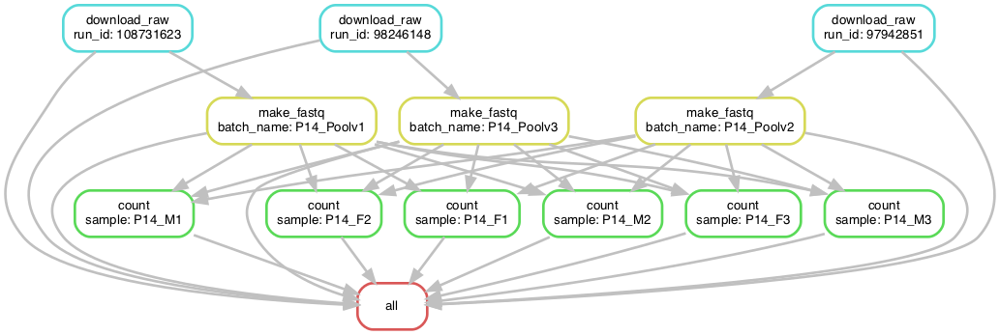

# pyflow-cellranger
a snakemake pipeline to process 10x genomics data using [cellranger](https://support.10xgenomics.com/single-cell-gene-expression/software/pipelines/latest/what-is-cell-ranger).

### work flow of the pipeline

Now, it is simply three steps: download, makefastqs and count.



The python downloader inside `scripts` folder is from https://help.basespace.illumina.com/articles/tutorials/using-the-python-run-downloader/

Also read the link above to get your tokens.

In the `config.yaml` file you can change settings. e.g. path to a different genome to align, and `cellranger` specific parameters. 

The advantage of a `snakemake` workflow is that the jobs are dispatched to the cluster in parallel when possible.
Snakemake has built-in `SLURM` support (see `pyflow-cellranger.sh`), so you do not worry about making the sbatch scripts. You can also change the queue, memory, time and others in the `cluster.json` file. When a certain step fails, rerun the whole workflow will only rerun the failed ones. One can also specify which step/sample you want to run.

one can change the parameters in the master `config.yaml` file. I can move many other `cellranger` specific parameters into the `config.yaml` file. 

### How to distribute workflows

read [doc](https://snakemake.readthedocs.io/en/stable/snakefiles/deployment.html)

```bash
ssh login.rc.fas.harvard.edu

# start a screen session
screen

git clone https://gitlab.com/dulaclab/pyflow_cellranger

cd pyflow_cellranger

## edit the config.yaml file as needed, e.g. set mouse or human for ref genome 
nano config.yaml

conda create -n snakemake python=3.6 -c snakemake
source activate snakemake

# need to prepare a meta.txt file containing run information, see example in the repo
# for each run, a csv file needs to be prepared as well for cellranger to make fastq.
# see examples in the repo. if you have 3 runs, you should have 3 csv files.
python sample2json.py meta.txt

## check the generated file
less -S samples.json
## dry run
./pyflow-cellranger.sh -np
```

### TO do

* add QC steps.
* doublet remove.

